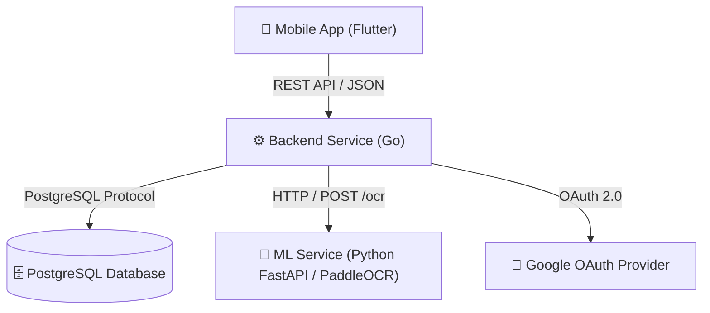

# 🥗 Food Analyser

[](https://go.dev/)
[](https://www.python.org/)
[](https://flutter.dev/)
[](https://www.docker.com/)

**Food Analyser** is a microservice-based mobile and backend platform designed to analyze food product ingredients and barcodes. It enables users to scan barcodes or upload label images, automatically extract Russian text using an OCR machine learning model (PaddleOCR), analyze ingredient safety/health impacts via an LLM, and provide comprehensive nutrition and safety insights.

> 🇷🇺 **Русская версия документации:** Доступна в файле [README_RU.md](./README_RU.md).

---

## 📐 System Architecture

The project consists of three core components:



### 1. Backend Service (`/backend`)
- **Language & Runtime:** Go 1.26
- **HTTP Framework:** `chi` router with structured logging (`slog`)
- **API Spec:** OpenAPI 3.0 generated via `oapi-codegen`
- **Database:** PostgreSQL with `pgx` connection pool and `golang-migrate` for schema migrations
- **Integrations:** Google OAuth 2.0 authentication, internal HTTP client for ML OCR service, LLM analysis service

### 2. Machine Learning OCR Service (`/ml`)
- **Language & Runtime:** Python 3.11 with `FastAPI` & `uvicorn`
- **OCR Engine:** `PaddleOCR` (configured for Russian text recognition)
- **Features:** Thread-safe model initialization, image pre-processing (Pillow/NumPy), text line confidence scoring, health monitoring

### 3. Mobile Frontend App (`/app`)
- **Framework:** Flutter (Dart SDK ^3.12.2)
- **State Management:** Riverpod (`flutter_riverpod`)
- **Features:** Barcode scanning (`mobile_scanner`), camera capture (`camera`), image picking (`image_picker`), Google Sign-In (`google_sign_in`), cross-platform navigation (`go_router`)

---

## 📁 Repository Structure

```
food-analyser/
├── app/                  # Flutter cross-platform mobile application
├── backend/              # Go REST API backend & database migrations
│   ├── api/              # OpenAPI specs & generated code configuration
│   ├── cmd/              # Main entrypoints (app, migrate)
│   ├── configs/          # Example configuration files (.env)
│   ├── internal/         # Business logic, HTTP handlers, repositories, services
│   └── migrations/       # PostgreSQL migration scripts (.sql)
├── ml/                   # Python FastAPI service for PaddleOCR inference
├── static/               # Assets and brand icons
├── docker-compose.yml    # Root multi-container orchestration
└── Taskfile.yml          # Root Taskfile runner
```

---

## ⚡ Quick Start with Docker Compose

The easiest way to run the entire backend infrastructure (PostgreSQL, automatic migrations, ML OCR service, Go Backend) is using Docker Compose.

### Prerequisites
- [Docker Desktop](https://www.docker.com/products/docker-desktop/) or Docker Engine with Docker Compose plugin installed.

### Run Infrastructure

```bash
# Clone the repository
git clone https://github.com/arseniizyk/food-analyser.git
cd food-analyser

# Start all services (PostgreSQL, ML OCR service, Migrations, Backend)
docker compose up -d --build
```

The services will be exposed at:
- **Backend REST API:** `http://localhost:8000`
- **ML OCR Service:** `http://localhost:8001` (internal `http://ml:8000`)
- **PostgreSQL Database:** `localhost:5432`

To view logs or stop services:
```bash
# View aggregated logs
docker compose logs -f

# Stop containers
docker compose down
```

---

## ⚙️ Local Development Setup

If you wish to run services locally without Docker:

### 1. PostgreSQL Database
Ensure PostgreSQL is running locally on port `5432` with a database named `food_analyser` (or adjust `.env`).

### 2. Backend Service (`/backend`)

**Prerequisites:** Go 1.26+, Task (optional)

```bash
cd backend

# Install formatters & dependencies
task deps:update

# Run database migrations
go run ./cmd/migrate -path ./configs/example.env

# Start backend server
go run ./cmd/app -path ./configs/example.env
```

### 3. ML OCR Service (`/ml`)

**Prerequisites:** Python 3.11+

```bash
cd ml

# Create virtualenv and install dependencies
python3 -m venv .venv
source .venv/bin/activate  # On Windows: .venv\Scripts\activate
pip install -r requirements.txt

# Run FastAPI server in dev mode with hot reload
uvicorn main:app --host 0.0.0.0 --port 8000 --reload
```

### 4. Mobile App (`/app`)

**Prerequisites:** Flutter SDK 3.12+

```bash
cd app

# Fetch dependencies
flutter pub get

# Run on emulator/connected device
flutter run
```

---

## 🛠 Taskfile Reference

This repository includes a root `Taskfile.yml` as well as dedicated sub-Taskfiles in `backend/` and `ml/`.

### Root Task Commands

| Command | Description |
| :--- | :--- |
| `task up` | Build and start all microservices using Docker Compose |
| `task down` | Stop and remove Docker Compose containers |
| `task logs` | Follow live container logs |
| `task ps` | Display status of running containers |
| `task restart` | Restart Docker Compose services |
| `task lint` | Run Go and Python code linters |
| `task format` | Run Go code formatters (`gofumpt`, `gci`) |
| `task app:deps` | Run `flutter pub get` for the mobile app |
| `task app:run` | Start the Flutter app |
| `task app:build` | Build release APK for Flutter app |

---

## 🔑 Environment Variables

The backend service is configured via environment variables or a `.env` file (see `backend/configs/example.env`):

| Variable | Default | Description |
| :--- | :--- | :--- |
| **HTTP_PORT** | `8000` | Port for the Go HTTP server |
| **HTTP_HOST** | `localhost` | Host bind address for backend |
| **POSTGRES_HOST** | `localhost` | PostgreSQL host |
| **POSTGRES_PORT** | `5432` | PostgreSQL port |
| **POSTGRES_USER** | `postgres` | Database username |
| **POSTGRES_PASSWORD**| `postgres` | Database password |
| **POSTGRES_DB** | `postgres` | Database name |
| **POSTGRES_SSLMODE** | `disable` | SSL mode (`disable`, `require`) |
| **ML_HOST** | `localhost` | Host for Python ML OCR service |
| **ML_PORT** | `8888` | Port for Python ML OCR service |
| **ML_TIMEOUT** | `10s` | HTTP timeout for OCR inference requests |
| **GOOGLE_OAUTH_CLIENT_ID** | `""` | Google Client ID for user authentication |

---

## 📡 API Overview

The Backend API is defined using OpenAPI 3.0 (`backend/api/backend/v1/backend.openapi.yaml`).

Key Endpoints:
- **`GET /api/v1/product/{barcode}`** — Retrieve product information by barcode.
- **`POST /api/v1/analyze/{barcode}`** — Analyze product ingredients and safety.
- **`POST /api/v1/auth/google`** — Authenticate user via Google OAuth token.

ML Service Endpoints (`/ml`):
- **`GET /health`** — OCR model readiness and health status.
- **`POST /ocr`** — Process multipart image upload and return recognized text lines with confidence scores.

---

## 📄 License

This project is licensed under the MIT License.
