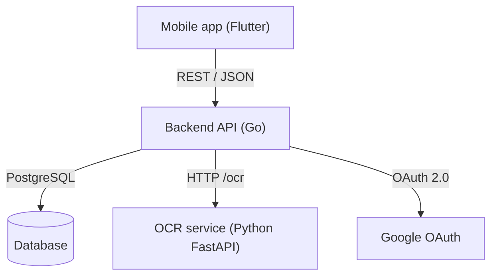

# 🥗 Foodify

[](https://go.dev/)
[](https://www.python.org/)
[](https://flutter.dev/)
[](https://www.docker.com/)

**Foodify** is a microservice-based platform for food product analysis. The Flutter app lets users scan barcodes or capture ingredient labels, the Go backend combines product lookup, Google OAuth, OCR orchestration, and LLM-based ingredient analysis, and the Python service handles Russian OCR with PaddleOCR.

This README is the English guide. The Russian version is available in [README_RU.md](./README_RU.md).

## What is in the repo



### Backend (`/backend`)

- Go 1.26 service built on `chi` and `slog`
- OpenAPI 3.0 contract generated with `oapi-codegen`
- PostgreSQL access via `pgx` and migrations via `golang-migrate`
- Integrations for Google OAuth, OCR, and LLM analysis

### ML service (`/ml`)

- Python 3.11 FastAPI app with `uvicorn`
- PaddleOCR configured for Russian text
- Health endpoint plus OCR inference endpoint

### Mobile app (`/app`)

- Flutter 3.12+ app with Riverpod state management
- Barcode scanning, camera capture, image picking, and Google Sign-In

## Repository layout

```
food-analyser/
├── app/           # Flutter mobile app
├── backend/       # Go backend and migrations
├── ml/            # Python OCR service
├── static/        # Shared static assets
├── docker-compose.yml
└── Taskfile.yml
```

## Self-run setup

The project can be started either with Docker Compose or service by service. The only mandatory setup step is to create a root `.env` file from the example before using Docker or the backend entrypoints.

### 1. Create the environment file

```bash
cp .example.env .env
```

Fill in the required values, especially:

- `GOOGLE_OAUTH_CLIENT_ID`
- `LLM_API_KEY`
- `LLM_MODEL`
- `LLM_URL`

The default ports in the example are:

- backend HTTP: `8000`
- ML service: `8888`
- PostgreSQL: `5432`

## Start with Docker Compose

### Prerequisites

- Docker Desktop or Docker Engine with the Compose plugin

### Run everything

```bash
git clone https://github.com/arseniizyk/food-analyser.git
cd food-analyser
cp .example.env .env
docker compose up -d --build
```

After startup, the services are available at:

- Backend API: `http://localhost:8000`
- ML OCR service: `http://localhost:8888`
- PostgreSQL: `localhost:5432`

To stop the stack:

```bash
docker compose down
```

## Run locally without Docker

### Backend prerequisites

- Go 1.26+
- PostgreSQL running locally
- A populated root `.env` file

### Backend commands

```bash
cd backend
go run ./cmd/migrate -path ../.example.env
go run ./cmd/app -path ../.example.env
```

Use `.env` instead of `.example.env` if you copied and edited the file.

### ML service prerequisites

- Python 3.11+

```bash
cd ml
python -m venv .venv
.venv\Scripts\activate
pip install -r requirements.txt
python -m uvicorn main:app --host 0.0.0.0 --port 8888 --reload
```

### Flutter app prerequisites

- Flutter 3.12+

```bash
cd app
flutter pub get
flutter run
```

## Taskfile commands

The root `Taskfile.yml` only provides the top-level Docker commands and includes the service-specific taskfiles.

### From the repository root

- `task up` - Build and start the full Docker stack
- `task down` - Stop the Docker stack
- `task backend:deps:update` - Run `go mod tidy`
- `task backend:format` - Format backend Go code
- `task backend:lint` - Run backend linting
- `task backend:lint:fix` - Run backend linting with fixes
- `task backend:gen` - Regenerate OpenAPI-based backend code
- `task app:deps` - Fetch Flutter dependencies
- `task app:run` - Run the Flutter app
- `task app:build` - Build the Flutter APK
- `task ml:setup` - Create the Python virtualenv and install ML dependencies
- `task ml:run` - Run the ML OCR service

## API overview

Backend endpoints:

- `GET /api/v1/product/{barcode}` - Fetch product data by barcode
- `POST /api/v1/analyze/{barcode}` - Analyze product ingredients
- `POST /api/v1/auth/google` - Authenticate with Google OAuth

ML endpoints:

- `GET /health` - Health check
- `POST /ocr` - OCR inference for uploaded images

## Testing and local checks

```bash
cd backend
go test ./...

cd ml
pip install -r requirements-dev.txt

cd app
flutter test
flutter analyze
```

## License

MIT License.
