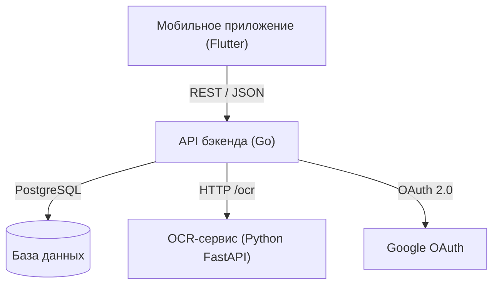

# 🥗 Foodify

[](https://go.dev/)
[](https://www.python.org/)
[](https://flutter.dev/)
[](https://www.docker.com/)

**Foodify** — микросервисная платформа для анализа пищевых продуктов. Мобильное приложение на Flutter умеет сканировать штрихкоды и фотографировать состав, бэкенд на Go отвечает за API, OAuth, запуск OCR и анализ состава через LLM, а Python-сервис выполняет OCR на PaddleOCR.

Если нужна английская версия документации, см. [README.MD](./README.MD).

## Что входит в репозиторий



### Бэкенд (`/backend`)

- Go 1.26, `chi`, `slog`
- OpenAPI 3.0 и генерация через `oapi-codegen`
- PostgreSQL, `pgx`, миграции через `golang-migrate`
- Google OAuth, OCR и LLM-анализ состава

### ML-сервис (`/ml`)

- Python 3.11, FastAPI и `uvicorn`
- PaddleOCR для русского текста
- Health endpoint и endpoint для распознавания

### Мобильное приложение (`/app`)

- Flutter 3.12+ и Riverpod
- Сканирование штрихкодов, камера, выбор фото, Google Sign-In

## Структура репозитория

```
food-analyser/
├── app/           # Мобильное приложение на Flutter
├── backend/       # Go бэкенд и миграции
├── ml/            # Python OCR-сервис
├── static/        # Общие статические ресурсы
├── docker-compose.yml
└── Taskfile.yml
```

## Самостоятельный запуск

Проект можно запускать через Docker Compose или по отдельности. Перед запуском нужно создать корневой `.env` на основе `.example.env`.

### 1. Подготовить конфиг

```bash
cp .example.env .env
```

Обязательно заполните:

- `GOOGLE_OAUTH_CLIENT_ID`
- `LLM_API_KEY`
- `LLM_MODEL`
- `LLM_URL`

Порты по умолчанию:

- бэкенд: `8000`
- ML-сервис: `8888`
- PostgreSQL: `5432`

## Запуск через Docker Compose

### Требования

- Docker Desktop или Docker Engine с Compose plugin

### Запуск

```bash
git clone https://github.com/arseniizyk/food-analyser.git
cd food-analyser
cp .example.env .env
docker compose up -d --build
```

После старта сервисы доступны по адресам:

- Backend API: `http://localhost:8000`
- ML OCR сервис: `http://localhost:8888`
- PostgreSQL: `localhost:5432`

Остановка стека:

```bash
docker compose down
```

## Локальный запуск без Docker

### Бэкенд

Требования:

- Go 1.26+
- локально запущенный PostgreSQL
- заполненный `.env`

```bash
cd backend
go run ./cmd/migrate -path ../.example.env
go run ./cmd/app -path ../.example.env
```

Если вы уже скопировали `.example.env` в `.env`, используйте `-path ../.env`.

### ML-сервис

Требования:

- Python 3.11+

```bash
cd ml
python -m venv .venv
.venv\Scripts\activate
pip install -r requirements.txt
python -m uvicorn main:app --host 0.0.0.0 --port 8888 --reload
```

### Мобильное приложение

Требования:

- Flutter 3.12+

```bash
cd app
flutter pub get
flutter run
```

## Команды Taskfile

В корне проекта есть `Taskfile.yml`, который подключает `backend/Taskfile.yml`, `ml/Taskfile.yml` и `app/Taskfile.yml`.

### Основные команды

- `task up` — собрать и запустить весь стек через Docker Compose
- `task down` — остановить стек Docker Compose
- `task backend:deps:update` — выполнить `go mod tidy`
- `task backend:format` — отформатировать backend-код
- `task backend:lint` — запустить линтер backend
- `task backend:lint:fix` — запустить линтер backend с автоисправлением
- `task backend:gen` — сгенерировать код из OpenAPI
- `task app:deps` — установить зависимости Flutter-приложения
- `task app:run` — запустить Flutter-приложение
- `task app:build` — собрать APK
- `task ml:setup` — создать Python virtualenv и установить зависимости
- `task ml:run` — запустить OCR-сервис

## API

Основные эндпоинты бэкенда:

- `GET /api/v1/product/{barcode}` — получить информацию о товаре
- `POST /api/v1/analyze/{barcode}` — проанализировать состав продукта
- `POST /api/v1/auth/google` — авторизация через Google OAuth

Эндпоинты ML-сервиса:

- `GET /health` — проверка готовности сервиса
- `POST /ocr` — распознавание текста из изображения

## Проверка локального запуска

```bash
cd backend
go test ./...

cd app
flutter analyze
flutter test
```

## Лицензия

MIT License.
