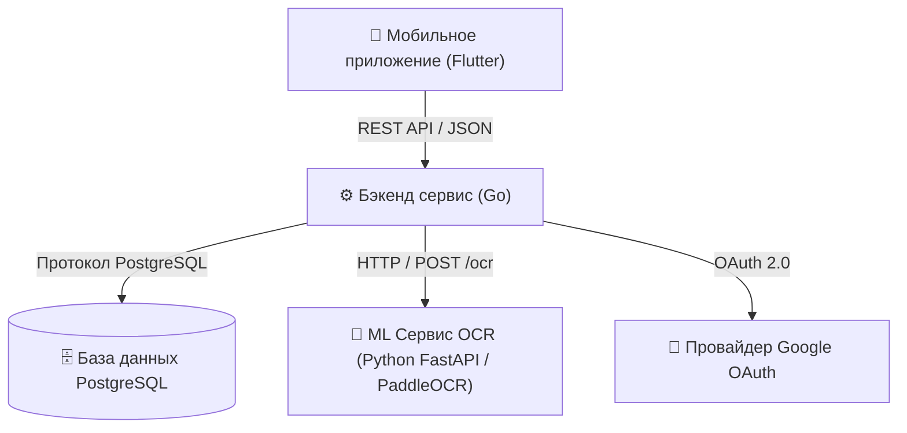

# 🥗 Food Analyser (Анализатор Продуктов)

[](https://go.dev/)
[](https://www.python.org/)
[](https://flutter.dev/)
[](https://www.docker.com/)

**Food Analyser** — это микросервисная платформa, состоящая из мобильного приложения и бэкенд-инфраструктуры, предназначенная для анализа состава пищевых продуктов и распознавания штрихкодов. Приложение позволяет сканировать штрихкоды или загружать фотографии состава, автоматически распознавать русскоязычный текст с помощью ML-модели (PaddleOCR), анализировать безопасность ингредиентов и вредные добавки с использованием LLM и предоставлять подробный отчет пользователю.

## 📐 Архитектура системы

Проект состоит из трех основных компонентов:



### 1. Бэкенд сервис (`/backend`)
- **Язык и среда:** Go 1.26
- **HTTP-фреймворк:** Роутер `chi` с структурированным логированием (`slog`)
- **Спецификация API:** OpenAPI 3.0, генерация кода через `oapi-codegen`
- **База данных:** PostgreSQL с пулом соединений `pgx` и миграциями через `golang-migrate`
- **Интеграции:** Авторизация через Google OAuth 2.0, HTTP-клиент для ML OCR сервиса, LLM-сервис анализа состава

### 2. ML OCR сервис (`/ml`)
- **Язык и среда:** Python 3.11 с `FastAPI` и `uvicorn`
- **Движок OCR:** `PaddleOCR` (настроен под распознавание русского языка)
- **Возможности:** Потокобезопасная инициализация модели (Singleton), предобработка изображений (Pillow/NumPy), вычисление уверенности распознавания (confidence), проверка работоспособности (Health check)

### 3. Мобильное приложение (`/app`)
- **Фреймворк:** Flutter (Dart SDK ^3.12.2)
- **Управление состоянием:** Riverpod (`flutter_riverpod`)
- **Функционал:** Сканирование штрихкодов (`mobile_scanner`), работа с камерой (`camera`), выбор фото (`image_picker`), в авторизция через Google (`google_sign_in`), кроссплатформенная навигация (`go_router`)

---

## 📁 Структура репозитория

```
food-analyser/
├── app/                  # Кроссплатформенное мобильное приложение на Flutter
├── backend/              # Бэкенд на Go и миграции базы данных
│   ├── api/              # Спецификации OpenAPI и конфигурация генерации
│   ├── cmd/              # Точки входа программ (app, migrate)
│   ├── configs/          # Примеры файлов конфигурации (.env)
│   ├── internal/         # Бизнес-логика, HTTP-хендлеры, репозитории, сервисы
│   └── migrations/       # Скрипты миграций PostgreSQL (.sql)
├── ml/                   # Python FastAPI сервис распознавания текста (PaddleOCR)
├── static/               # Статические ресурсы и логотипы
├── docker-compose.yml    # Файл оркестрации контейнеров
└── Taskfile.yml          # Главный файл запуска команд Taskfile
```

---

## ⚡ Быстрый запуск через Docker Compose

Самый простой способ запустить всю бэкенд-инфраструктуру (PostgreSQL, автоматические миграции БД, ML OCR сервис и Go бэкенд) — использовать Docker Compose.

### Требования
- Установленный [Docker Desktop](https://www.docker.com/products/docker-desktop/) или Docker Engine с плагином Docker Compose.

### Запуск контейнеров

```bash
# Клонирование репозитория
git clone https://github.com/arseniizyk/food-analyser.git
cd food-analyser

# Запуск всех сервисов (PostgreSQL, ML OCR, Миграции, Бэкенд)
docker compose up -d --build
```

Сервисы будут доступны по следующим адресам:
- **Backend REST API:** `http://localhost:8000`
- **ML OCR Сервис:** `http://localhost:8001` (внутренний адрес `http://ml:8000`)
- **База данных PostgreSQL:** `localhost:5432`

Просмотр логов и остановка:
```bash
# Просмотр общих логов
docker compose logs -f

# Остановка контейнеров
docker compose down
```

---

## ⚙️ Локальная разработка

Если вам необходимо запустить компоненты локально без Docker:

### 1. База данных PostgreSQL
Убедитесь, что локально запущен PostgreSQL на порту `5432` с базой данных `food_analyser` (или измените параметры в `.env`).

### 2. Бэкенд сервис (`/backend`)

**Требования:** Go 1.26+, Task (опционально)

```bash
cd backend

# Установка форматировщиков и обновление зависимостей
task deps:update

# Запуск миграций базы данных
go run ./cmd/migrate -path ./configs/example.env

# Запуск бэкенд-сервера
go run ./cmd/app -path ./configs/example.env
```

### 3. ML OCR сервис (`/ml`)

**Требования:** Python 3.11+

```bash
cd ml

# Создание виртуального окружения и установка зависимостей
python3 -m venv .venv
source .venv/bin/activate  # Для Windows: .venv\Scripts\activate
pip install -r requirements.txt

# Запуск сервера FastAPI с автоперезагрузкой (hot reload)
uvicorn main:app --host 0.0.0.0 --port 8000 --reload
```

### 4. Мобильное приложение (`/app`)

**Требования:** Flutter SDK 3.12+

```bash
cd app

# Загрузка зависимостей
flutter pub get

# Запуск на эмуляторе или подключенном устройстве
flutter run
```

---

## 🛠 Справочник команд Taskfile

В корне проекта находится главный `Taskfile.yml`, который объединяет команды бэкенда и ML-сервиса.

### Команды главного Taskfile

| Команда | Описание |
| :--- | :--- |
| `task up` | Собрать и запустить все микросервисы через Docker Compose |
| `task down` | Остановить и удалить контейнеры Docker Compose |
| `task logs` | Просматривать логи контейнеров в реальном времени |
| `task ps` | Показать статус запущенных контейнеров |
| `task restart` | Перезапустить сервисы Docker Compose |
| `task lint` | Запустить линтеры для Go и Python кода |
| `task format` | Запустить форматирование Go-кода (`gofumpt`, `gci`) |
| `task app:deps` | Установить зависимости Flutter приложения (`flutter pub get`) |
| `task app:run` | Запустить мобильное приложение Flutter |
| `task app:build` | Собрать релизный APK Flutter приложения |

---

## 🔑 Переменные окружения

Бэкенд сервис настраивается через переменные окружения или `.env` файл (см. `backend/configs/example.env`):

| Переменная | Значение по умолчанию | Описание |
| :--- | :--- | :--- |
| **HTTP_PORT** | `8000` | Порт для HTTP бэкенд-сервера Go |
| **HTTP_HOST** | `localhost` | Хост бэкенд-сервера |
| **POSTGRES_HOST** | `localhost` | Хост базы данных PostgreSQL |
| **POSTGRES_PORT** | `5432` | Порт PostgreSQL |
| **POSTGRES_USER** | `postgres` | Имя пользователя БД |
| **POSTGRES_PASSWORD**| `postgres` | Пароль пользователя БД |
| **POSTGRES_DB** | `postgres` | Имя базы данных |
| **POSTGRES_SSLMODE** | `disable` | Режим SSL (`disable`, `require`) |
| **ML_HOST** | `localhost` | Хост ML OCR сервиса на Python |
| **ML_PORT** | `8888` | Порт ML OCR сервиса |
| **ML_TIMEOUT** | `10s` | Таймаут для запроса к OCR сервису |
| **GOOGLE_OAUTH_CLIENT_ID** | `""` | Google Client ID для аутентификации пользователей |

---

## 📡 Описание API

Бэкенд API спроектирован по стандарту OpenAPI 3.0 (`backend/api/backend/v1/backend.openapi.yaml`).

Основные эндпоинты:
- **`GET /api/v1/product/{barcode}`** — Получение информации о продукте по штрихкоду.
- **`POST /api/v1/analyze/{barcode}`** — Анализ состава продукта и безопасности ингредиентов.
- **`POST /api/v1/auth/google`** — Аутентификация пользователя через Google OAuth токен.

Эндпоинты ML сервиса (`/ml`):
- **`GET /health`** — Проверка готовности OCR модели и статуса сервиса.
- **`POST /ocr`** — Загрузка изображения состава товара и распознавание текста с оценкой уверенности.

---

## 📄 Лицензия

Проект распространяется с открытым исходным кодом. См. лицензии сторонних библиотек в соответствующих директориях.
